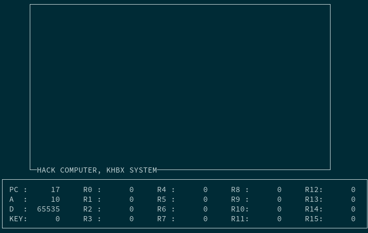

# Nand2Tetris
[Build a Modern Computer from First Principles](https://www.nand2tetris.org/)

- All combinational chips are constructed from Nand gates.
- All sequential chips are constructed from DFF gates, and combinational chips.

## Architecture
- 16-bit computer.
- 32KB of RAM (16K registers of 16 bits).

## Capabilities
- VHDL hack computer can execute small binary programs which are preloaded in ROM, such as addition, multiplication, max function.
- Results can be checked using a test bench, by analyzing signals through gtkwave, or using the ncurses based co-simulation.
- In co-simulation, screen and keyboards IO are stubbed, thus it is possible to run the screen binary.

## Tools
- ghdl
- gtkwave

## Co-simulation
- Co-simulation based on VHPIDIRECT (https://ghdl.github.io/ghdl-cosim/).
- Display in terminal using ncurses to emulate IO (screen and keyboard).

### Example: fill screen program
- Runs an infinite loop that listens to the keyboard input.
- When a key is pressed, the program blackens the screen.
- When no key is pressed, the program clears the screen.

## Usage
- `make` to build everything.
- `make test` to use testbench to validate the computer design.
- `make wave` to extract programs executions signals.
- `make test_cosim` to run our cosimulation using screen program in ROM.

## Todo
- For co-simulation: set frequency, start, continue, pause, reset.
- For co-simulation: interactive ROM loading.
- For co-simulation: RAM/ROM monitoring screen.
- For co-simulation: help screen.
- Assembler for asm.
- Try to port it to an FPGA board.

